# 🤖 AI Asistan — Masaüstü Yapay Zekâ Yardımcısı

Bilgisayarda herhangi bir uygulamada seçtiğin metni **`F8`** tuşuyla yerel yapay zekâya gönderir; gramer düzeltme, çeviri, özetleme, Gantt şeması oluşturma ve daha fazlasını tek tuşla yapar.

---

## Projenin Amacı

Günlük bilgisayar kullanımında sürekli tekrarlanan metin işlemleri vardır: bir metni düzeltmek, İngilizceye çevirmek, gelen bir e-postaya cevap taslağı hazırlamak, proje görevlerini Gantt şemasına ve Kritik Yol analizine dönüştürmek…

Bu uygulamayla söz konusu işlemlerin hepsi **iki adımda** tamamlanır:

1. Metni seç
2. `F8` tuşuna bas, menüden işlemi seç

Uygulama arka planda sessizce çalışır. Tarayıcı açmana, kopyala-yapıştır yapman gerekmez; sonuç doğrudan bulunduğun alana yapıştırılır.

---

## Özellikler

| Menü Seçeneği | Ne Yapar? |
|---|---|
| 📝 Gramer Düzelt | Türkçe yazım hatalarını düzeltir |
| 🇬🇧 İngilizceye Çevir | Seçili metni İngilizceye çevirir |
| 🇹🇷 Türkçeye Çevir | Seçili metni Türkçeye çevirir |
| 📑 Özetle (Madde Madde) | Ana noktaları maddeler hâlinde çıkarır |
| 💼 Daha Resmi Yap | Kurumsal e-posta diline dönüştürür |
| 🐍 Python Koduna Çevir | Metindeki isteği Python koduna çevirir |
| 📧 Cevap Yaz (Mail) | Gelen e-postaya profesyonel cevap taslağı üretir |
| 💬 Mesaja 3 Cevap Öner | Aynı mesaja samimi / resmi / kısa-net 3 cevap üretir |
| 🧩 Görev Metnini Gantt Formatına Çevir | Serbest yazılmış görev metnini yapılandırılmış Gantt formatına çevirir |
| 📊 Gantt ve Kritik Yol Arayüzünü Aç | Görev listesini alır, tarayıcıda interaktif Gantt + Kritik Yol arayüzünü açar |
| 🎮 PS5 Oyun Skor + Acımasız Yorum | Oyun adına göre topluluk skorları ve sert yorum üretir |

---

## Genel Çalışma Mantığı

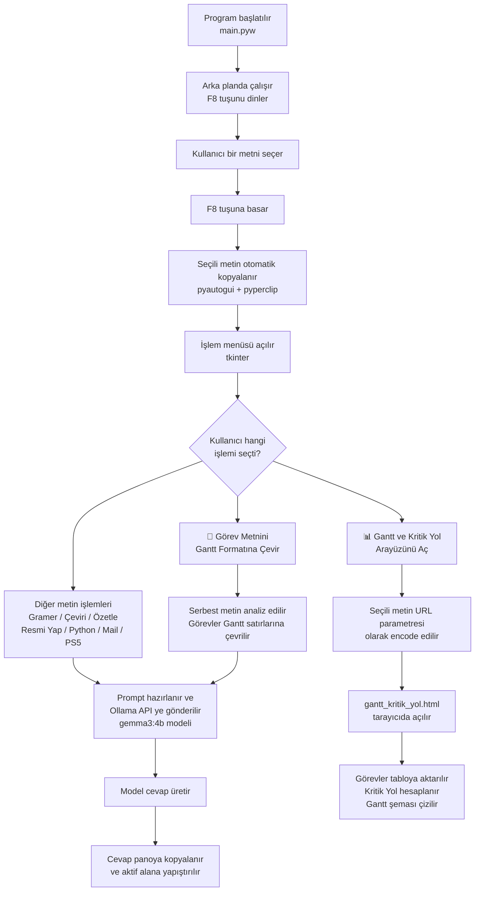

---

## 🧩 Görev Metnini Gantt Formatına Çevir

Bu özellik, serbest dille yazılmış bir proje açıklamasını yapay zekâ aracılığıyla **yapılandırılmış Gantt satırlarına** dönüştürür. Kullanıcının proje görevlerini tek tek elle yazması gerekmez; doğal Türkçe ile yazılmış herhangi bir metin girdi olarak kullanılabilir.

### Nasıl Çalışır?

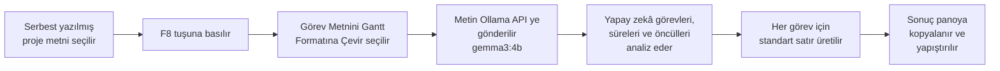

### Girdi — Serbest Proje Metni

Kullanıcı, serbest dille yazılmış proje açıklamasını herhangi bir uygulamada seçer ve `F8` tuşuna basar. Menüden **Görev Metnini Gantt Formatına Çevir** seçeneğini seçer.

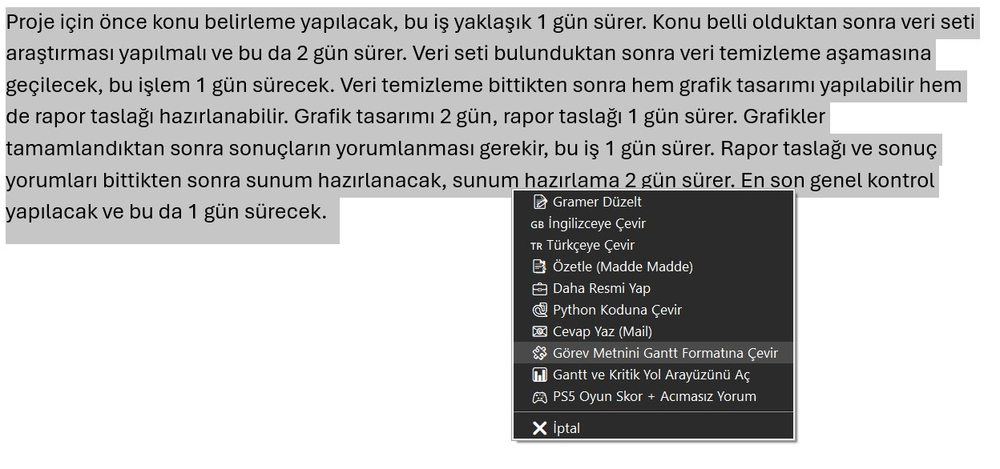

> Serbest dilde yazılmış proje metni seçilmiş; F8 menüsünden **Görev Metnini Gantt Formatına Çevir** seçilmek üzere.

---

### Çıktı — Yapılandırılmış Gantt Satırları

Yapay zekâ metni analiz eder ve her görevi aşağıdaki standart formata dönüştürür. Sonuç panoya kopyalanır ve aktif alana otomatik yapıştırılır.

**Çıktı formatı:**

```
1. Görev adı | Süre: X gün | Öncül: yok
2. Görev adı | Süre: X gün | Öncül: 1
3. Görev adı | Süre: X gün | Öncül: 1,2
```

**Örnek:**

```
1. Konu belirleme | Süre: 1 gün | Öncül: yok
2. Veri seti araştırması | Süre: 2 gün | Öncül: yok
3. Veri temizleme | Süre: 1 gün | Öncül: yok
4. Grafik tasarımı | Süre: 2 gün | Öncül: yok
5. Rapor taslağı hazırlanması | Süre: 1 gün | Öncül: yok
6. Sonuçların yorumlanması | Süre: 1 gün | Öncül: yok
7. Sunum hazırlanması | Süre: 2 gün | Öncül: yok
8. Genel kontrol | Süre: 1 gün | Öncül: yok
```

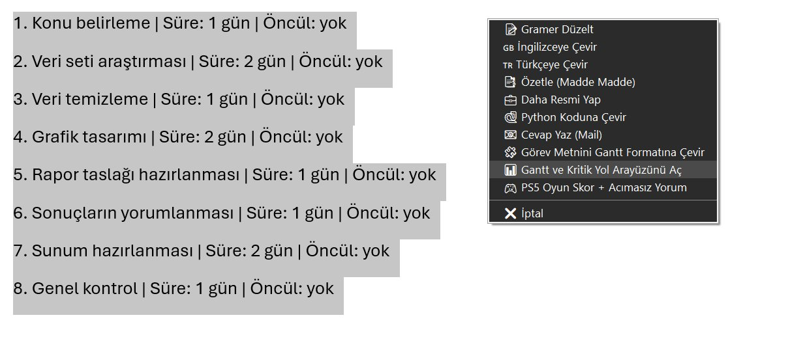

> Görev metnini Gantt Formatına Çevir özelliğinin ürettiği yapılandırılmış çıktı seçilmiş; bir sonraki adımda **Gantt ve Kritik Yol Arayüzünü Aç** seçilmek üzere.

---

## 📊 Gantt ve Kritik Yol Arayüzünü Aç

Bu özellik, önceki adımda üretilen yapılandırılmış görev listesini alır ve tarayıcıda interaktif bir Gantt + Kritik Yol analiz arayüzü açar. Tüm hesaplamalar otomatik olarak yapılır.

### Nasıl Çalışır?

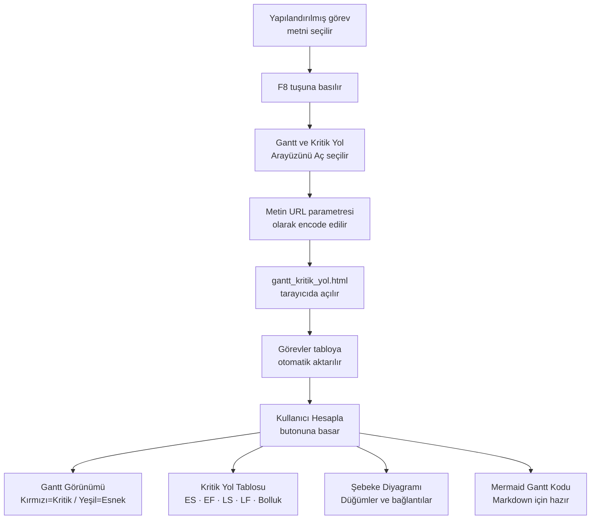

---

### Adım 1 — Görev Tablosu

Arayüz açıldığında görevler otomatik olarak tabloya aktarılır. Görev adları, süreler, birimler ve öncül ilişkileri buradan düzenlenebilir.

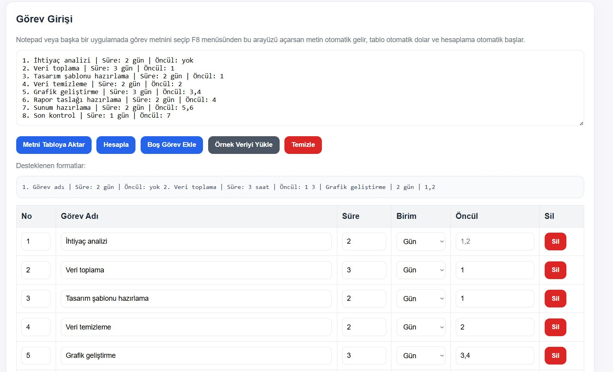

> Görev girişi tablosu: Yapılandırılmış metin otomatik olarak satırlara ayrılmış, her görevin süresi ve öncülü düzenlenebilir durumda.

---

### Adım 2 — Gantt Görünümü ve Proje Özeti

**Hesapla** butonuna basıldığında Gantt şeması çizilir. Üstte toplam proje süresi, kritik yol dizisi ve kritik görev sayısı özetlenir.

- **Kırmızı çubuklar** → Kritik yol üzerindeki görevler. Gecikmesi projenin teslim tarihini geciktirir.
- **Yeşil çubuklar** → Zaman esnekliği olan görevler. Belirli bir süre gecikse bile projeyi etkilemez.

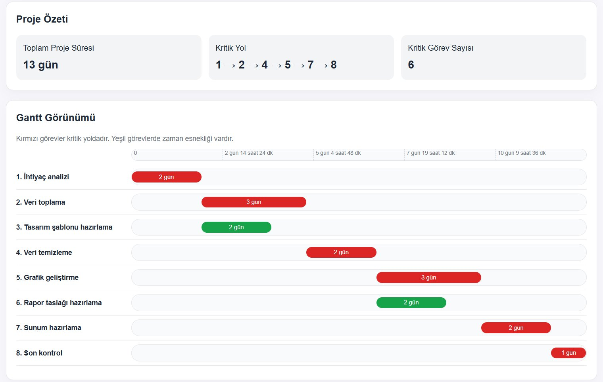

> Proje Özeti: Toplam süre, kritik yol (1→2→4→5→7→8) ve kritik görev sayısı. Altında renkli Gantt şeması.

---

### Adım 3 — Kritik Yol Tablosu

Her görev için CPM (Critical Path Method) hesaplaması yapılır ve sonuçlar tablo olarak sunulur.

| Sütun | Açıklama |
|---|---|
| **ES** (En Erken Başlama) | Görevin en erken başlayabileceği gün |
| **EF** (En Erken Bitiş) | Görevin en erken bitebileceği gün |
| **LS** (En Geç Başlama) | Projeyi geciktirmeden en geç başlanabilecek gün |
| **LF** (En Geç Bitiş) | Projeyi geciktirmeden en geç bitirilebilecek gün |
| **Bolluk** | Görevin ne kadar gecikebileceği (0 = Kritik) |

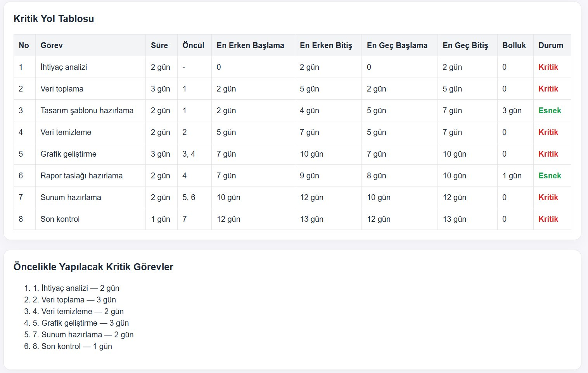

> Kritik Yol Tablosu: Bolluk değeri 0 olan görevler **Kritik**, 0'dan büyük olanlar **Esnek** olarak işaretlenir.

---

### Adım 4 — Şebeke Diyagramı

Görevler arasındaki bağımlılık ilişkileri görsel olarak şebeke diyagramında gösterilir. Kırmızı düğümler ve oklar kritik yolu; gri düğümler kritik olmayan görevleri temsil eder.

Her düğümde şu bilgiler bulunur:
- Görev numarası ve adı
- **ES** (En Erken Başlama)
- **B** (Bolluk)

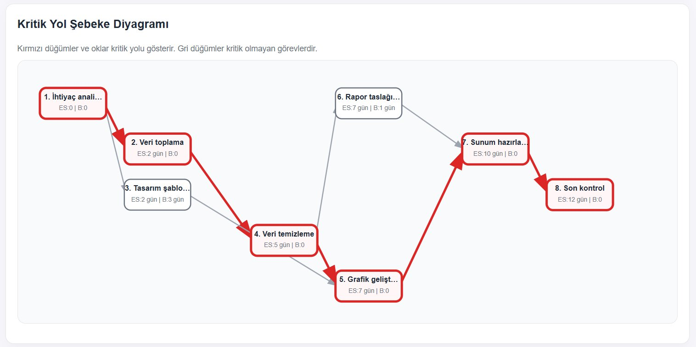

> Şebeke Diyagramı: Kırmızı oklar ve düğümler kritik yolu (1→2→4→5→7→8) göstermektedir. Gri düğümler esnek görevlerdir.

---

### Adım 5 — Mermaid Gantt Kodu

Arayüz, hesaplanan Gantt şemasını aynı zamanda **Mermaid formatında** da üretir. Bu kod GitHub README dosyasına, Notion'a veya Mermaid destekleyen herhangi bir editöre yapıştırıldığında otomatik olarak diyagram hâlinde görüntülenir.

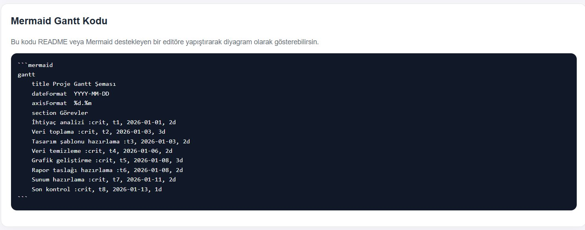

> Otomatik üretilmiş Mermaid Gantt kodu: Kritik görevler `:crit` etiketiyle işaretlenmiş, tarihler ve süreler hesaplanmış.

---

## Tam Kullanım Akışı — Serbest Metinden Gantt'a

Aşağıdaki diyagram her iki özelliğin birlikte nasıl kullanıldığını göstermektedir:

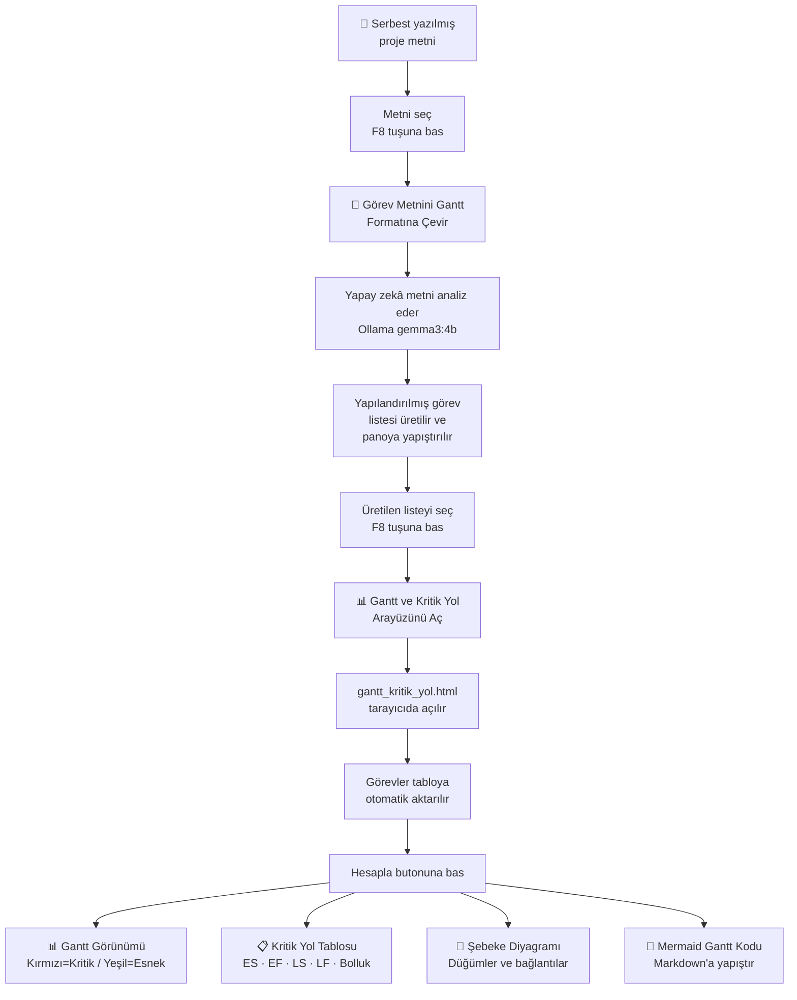

---

## Gereksinimler

### Sistem

- Python 3.x
- [Ollama](https://ollama.com) (yerel yapay zekâ motoru)
- `gemma3:4b` modeli
- Windows işletim sistemi
- Git (isteğe bağlı)

### Python Paketleri

```
requests
pyperclip
pynput
pyautogui
```

| Paket | Görevi |
|---|---|
| `requests` | Ollama API'ye HTTP isteği gönderir |
| `pyperclip` | Panodan okur, panoya yazar |
| `pynput` | F8 tuşunu arka planda dinler |
| `pyautogui` | Seçili metni otomatik kopyalar, sonucu yapıştırır |

---

## Kurulum

### 1. Ollama Kur ve Modeli İndir

[ollama.com](https://ollama.com) adresinden Ollama'yı kur, ardından terminalde:

```bash
ollama pull gemma3:4b
```

Kurulumu kontrol et:

```bash
ollama list
# Listede gemma3:4b görünmeli
```

### 2. Projeyi Çalıştır

**Windows üzerinde (önerilen):**

```bash
BASLAT.bat
```

Bu dosya ilk çalıştırmada sanal ortamı ve gerekli paketleri kurar, sonraki çalıştırmalarda uygulamayı doğrudan başlatır.

**Alternatif:**

```bash
pip install -r requirements.txt
python main.pyw
```

---

## Proje Yapısı

```
.
├── main.pyw                  # Ana uygulama — F8 dinleme, menü, Ollama entegrasyonu
├── gantt_kritik_yol.html     # Gantt + Kritik Yol arayüzü (tarayıcıda açılır)
├── requirements.txt          # Python bağımlılıkları
├── BASLAT.bat                # Windows hızlı başlatma + kurulum
├── kurulum.bat               # Yalnızca kurulum
├── assets/                   # README görselleri
│   ├── 01-serbest-metin-f8-menu.png
│   ├── 02-gantt-format-f8-menu.png
│   ├── 03-gorev-giris-tablosu.png
│   ├── 04-gantt-gorunumu-proje-ozeti.png
│   ├── 05-kritik-yol-tablosu.png
│   ├── 06-sebeke-diyagrami.png
│   └── 07-mermaid-gantt-kodu.png
├── .gitignore
└── README.md
```

---

## Kullanılan Teknolojiler

- **Python** — Ana uygulama dili
- **Ollama** — Yerel LLM motoru (`gemma3:4b` modeli)
- **tkinter** — İşlem menüsü (GUI)
- **pynput / pyautogui / pyperclip** — Klavye ve pano otomasyonu
- **HTML / JavaScript** — Gantt ve Kritik Yol arayüzü (tarayıcı tabanlı)
- **CPM (Critical Path Method)** — Kritik yol hesaplama algoritması

---

## Sorun Giderme

**F8 tuşu çalışmıyor:**
Programın çalıştığından emin ol. Bazı bilgisayarlarda `Fn + F8` kombinasyonu gerekebilir. Başka bir uygulama F8'i kullanıyor olabilir.

**Seçili metin algılanmıyor:**
Metni gerçekten seçtiğinden ve seçim aktifken F8'e bastığından emin ol.

**Ollama bağlantı hatası:**
`ollama list` komutunu çalıştır. Model listede görünmüyorsa `ollama pull gemma3:4b` ile yeniden indir. Ollama model indirildikten sonra tamamen yerel çalışır, internet bağlantısı gerekmez.

**Gantt arayüzü açılmıyor:**
`gantt_kritik_yol.html` dosyasının `main.pyw` ile aynı klasörde olduğundan emin ol.

**Görevler tabloya aktarılmıyor:**
Seçili metnin `Görev Metnini Gantt Formatına Çevir` özelliğiyle üretildiğinden emin ol. Beklenen format: `1. Görev adı | Süre: X gün | Öncül: yok`

---

## Gizlilik

Tüm işlemler yerel bilgisayarında, Ollama üzerinden çalışır. Seçtiğin metinler hiçbir bulut servisine gönderilmez.
