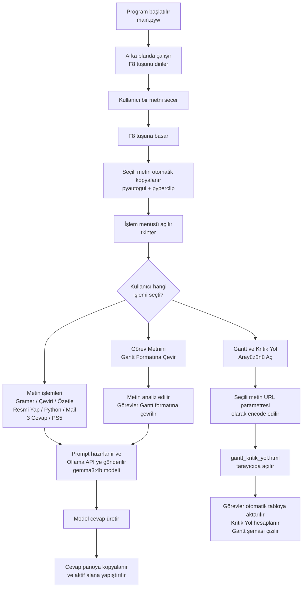
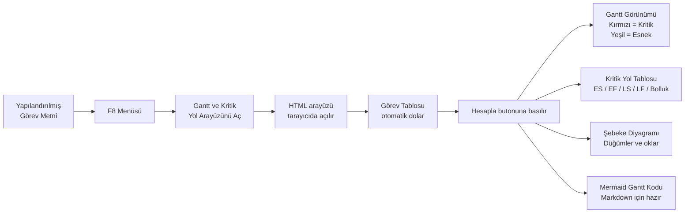
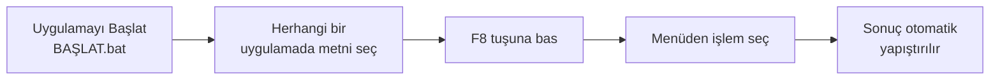

# 🤖 AI Asistan — Masaüstü Yapay Zekâ Yardımcısı

Bilgisayarda herhangi bir uygulamada seçtiğin metni **`F8`** tuşuyla yerel yapay zekâya gönderir; gramer düzeltme, çeviri, özetleme, Gantt şeması oluşturma ve daha fazlasını tek tuşla yapar.

---

## Projenin Amacı

Günlük bilgisayar kullanımında sürekli tekrarlanan metin işlemleri vardır: bir metni düzeltmek, İngilizceye çevirmek, gelen bir e-postaya cevap taslağı hazırlamak, proje görevlerini Gantt şemasına dönüştürmek…

Bu uygulamayla söz konusu işlemlerin hepsi **iki adımda** tamamlanır:

1. Metni seç
2. `F8` tuşuna bas, menüden işlemi seç

Uygulama arka planda sessizce çalışır. Tarayıcı açmana, kopyala-yapıştır yapman gerekmez; sonuç doğrudan bulunduğun alana yapıştırılır.

---

## Özellikler

| Menü Seçeneği | Ne Yapar? |
|---|---|
| 📝 Gramer Düzelt | Türkçe yazım hatalarını düzeltir |
| 🇬🇧 İngilizceye Çevir | Seçili metni İngilizceye çevirir |
| 🇹🇷 Türkçeye Çevir | Seçili metni Türkçeye çevirir |
| 📑 Özetle (Madde Madde) | Ana noktaları maddeler hâlinde çıkarır |
| 💼 Daha Resmi Yap | Kurumsal e-posta diline dönüştürür |
| 🐍 Python Koduna Çevir | Metindeki isteği Python koduna çevirir |
| 📧 Cevap Yaz (Mail) | Gelen e-postaya profesyonel cevap taslağı üretir |
| 💬 Mesaja 3 Cevap Öner | Aynı mesaja samimi / resmi / kısa-net 3 cevap üretir |
| 🧩 Görev Metnini Gantt Formatına Çevir | Serbest yazılmış görev metnini yapılandırılmış Gantt formatına çevirir |
| 📊 Gantt ve Kritik Yol Arayüzünü Aç | Görev listesini alır, tarayıcıda interaktif Gantt + Kritik Yol arayüzünü açar |
| 🎮 PS5 Oyun Skor + Acımasız Yorum | Oyun adına göre topluluk skorları ve sert yorum üretir |

---

## Çalışma Mantığı



---

## Gantt ve Kritik Yol Özelliği — Detaylı Akış

Bu özellik iki aşamalı çalışır ve proje yönetimine gerçek bir katma değer sunar.

### Aşama 1 — Metni Gantt Formatına Çevir

Serbest yazılmış proje açıklamasını önce yapılandırılmış formata dönüştürmek gerekir.

**Örnek girdi (seçilen metin):**

```
Proje için önce konu belirleme yapılacak, bu iş yaklaşık 1 gün sürer. Konu belli
olduktan sonra veri seti araştırması yapılmalı ve bu da 2 gün sürer. Veri seti
bulunduktan sonra veri temizleme aşamasına geçilecek, bu işlem 1 gün sürecek...
```

Kullanıcı metni seçip `F8` → **Görev Metnini Gantt Formatına Çevir** seçeneğini seçer.

**Üretilen çıktı (panoya yapıştırılır):**

```
1. Konu belirleme | Süre: 1 gün | Öncül: yok
2. Veri seti araştırması | Süre: 2 gün | Öncül: yok
3. Veri temizleme | Süre: 1 gün | Öncül: yok
...
```

### Aşama 2 — Gantt Arayüzünü Aç

Bu kez yapılandırılmış metni seçip `F8` → **Gantt ve Kritik Yol Arayüzünü Aç** seçeneğini seçer.

Tarayıcıda `gantt_kritik_yol.html` dosyası açılır ve metin otomatik olarak tabloya aktarılır.



---

## Ekran Görüntüleri

### F8 Menüsü

Herhangi bir uygulamada metin seçilip `F8` tuşuna basıldığında işlem menüsü açılır. Kullanmak istenen özellik buradan seçilir.

> **Görsel 1:** Yapılandırılmış görev listesi seçilmiş, F8 menüsü açık — "Gantt ve Kritik Yol Arayüzünü Aç" seçeneği görünüyor.

> **Görsel 2:** Serbest yazılmış proje metni seçilmiş, F8 menüsü açık — "Görev Metnini Gantt Formatına Çevir" seçeneği görünüyor.

---

### Gantt Arayüzü — Görev Girişi

Metin otomatik olarak tabloya aktarılır. Görevler, süreleri ve öncül ilişkileri düzenlenebilir durumdadır.

> **Görsel 3:** Görev girişi ekranı — Metin tabloya aktarılmış, "Hesapla" butonu bekleniyor.

---

### Gantt Görünümü ve Proje Özeti

Hesaplama tamamlandığında Gantt şeması çizilir. Kırmızı görevler kritik yoldadır (gecikmesi projeyi geciktirir), yeşil görevlerde zaman esnekliği vardır.

> **Görsel 4:** Proje Özeti (toplam süre, kritik yol, kritik görev sayısı) ve Gantt Görünümü.

---

### Kritik Yol Tablosu

Her görev için En Erken Başlama, En Erken Bitiş, En Geç Başlama, En Geç Bitiş ve Bolluk değerleri hesaplanır.

> **Görsel 5:** Kritik Yol Tablosu — Kırmızı satırlar kritik, yeşil satırlar esnek görevlerdir.

---

### Şebeke Diyagramı

Görevler arasındaki bağımlılıklar görsel olarak şebeke diyagramında gösterilir. Kırmızı düğümler ve oklar kritik yolu işaret eder.

> **Görsel 6:** Kritik Yol Şebeke Diyagramı.

---

### Mermaid Gantt Kodu

Üretilen Gantt şeması, README veya Mermaid destekleyen herhangi bir editöre yapıştırılabilir formatta da sunulur.

> **Görsel 7:** Otomatik üretilmiş Mermaid Gantt kodu.

---

## Gereksinimler

### Sistem

- Python 3.x
- [Ollama](https://ollama.com) (yerel yapay zekâ motoru)
- `gemma3:4b` modeli
- Windows işletim sistemi
- Git (isteğe bağlı)

### Python Paketleri

```
requests
pyperclip
pynput
pyautogui
```

| Paket | Görevi |
|---|---|
| `requests` | Ollama API'ye HTTP isteği gönderir |
| `pyperclip` | Panodan okur, panoya yazar |
| `pynput` | F8 tuşunu arka planda dinler |
| `pyautogui` | Seçili metni otomatik kopyalar, sonucu yapıştırır |

---

## Kurulum

### 1. Ollama Kur ve Modeli İndir

[ollama.com](https://ollama.com) adresinden Ollama'yı kur, ardından terminalde:

```bash
ollama pull gemma3:4b
```

Kurulumu kontrol et:

```bash
ollama list
# gemma3:4b görünmeli
```

### 2. Projeyi Çalıştır

**Windows üzerinde (önerilen):**

```bash
BASLAT.bat
```

Bu dosya ilk çalıştırmada sanal ortamı ve gerekli paketleri kurar, sonraki çalıştırmalarda uygulamayı doğrudan başlatır.

**Alternatif:**

```bash
pip install -r requirements.txt
python main.pyw
```

---

## Kullanım — Adım Adım



1. `BASLAT.bat` dosyasını çalıştır — program arka planda başlar.
2. WhatsApp Web, Notepad, e-posta, tarayıcı — fark etmez, istediğin uygulamada bir metni seç.
3. `F8` tuşuna bas.
4. Açılan menüden istediğin işlemi seç.
5. İşlem tamamlandığında sonuç bulunduğun alana otomatik yapıştırılır.

---

## Proje Yapısı

```
.
├── main.pyw                  # Ana uygulama — F8 dinleme, menü, Ollama entegrasyonu
├── gantt_kritik_yol.html     # Gantt + Kritik Yol arayüzü (tarayıcıda açılır)
├── requirements.txt          # Python bağımlılıkları
├── BASLAT.bat                # Windows hızlı başlatma + kurulum
├── kurulum.bat               # Yalnızca kurulum
├── .gitignore
└── README.md
```

---

## Kullanılan Teknolojiler

- **Python** — Ana uygulama dili
- **Ollama** — Yerel LLM motoru (`gemma3:4b` modeli)
- **tkinter** — İşlem menüsü (GUI)
- **pynput / pyautogui / pyperclip** — Klavye ve pano otomasyonu
- **HTML / JavaScript** — Gantt ve Kritik Yol arayüzü (tarayıcı tabanlı)

---

## Sorun Giderme

**F8 tuşu çalışmıyor:**
Programın çalıştığından emin ol. Bazı bilgisayarlarda `Fn + F8` kombinasyonu gerekebilir. Başka bir uygulama F8'i kullanıyor olabilir.

**Seçili metin algılanmıyor:**
Metni gerçekten seçtiğinden ve seçim aktifken F8'e bastığından emin ol.

**Ollama bağlantı hatası:**
`ollama list` komutunu çalıştır. Model listede görünmüyorsa `ollama pull gemma3:4b` ile yeniden indir. Ollama bir internet bağlantısı gerektirmez; model indirildikten sonra tamamen yerel çalışır.

**Gantt arayüzü açılmıyor:**
`gantt_kritik_yol.html` dosyasının `main.pyw` ile aynı klasörde olduğundan emin ol.

---

## Gizlilik

Tüm işlemler yerel bilgisayarında, Ollama üzerinden çalışır. Seçtiğin metinler hiçbir bulut servisine gönderilmez.
